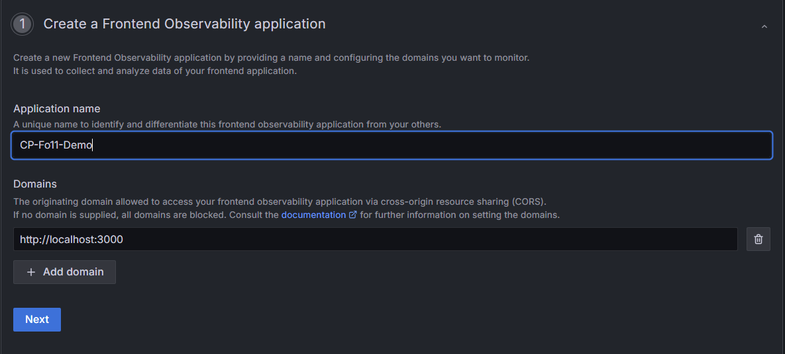
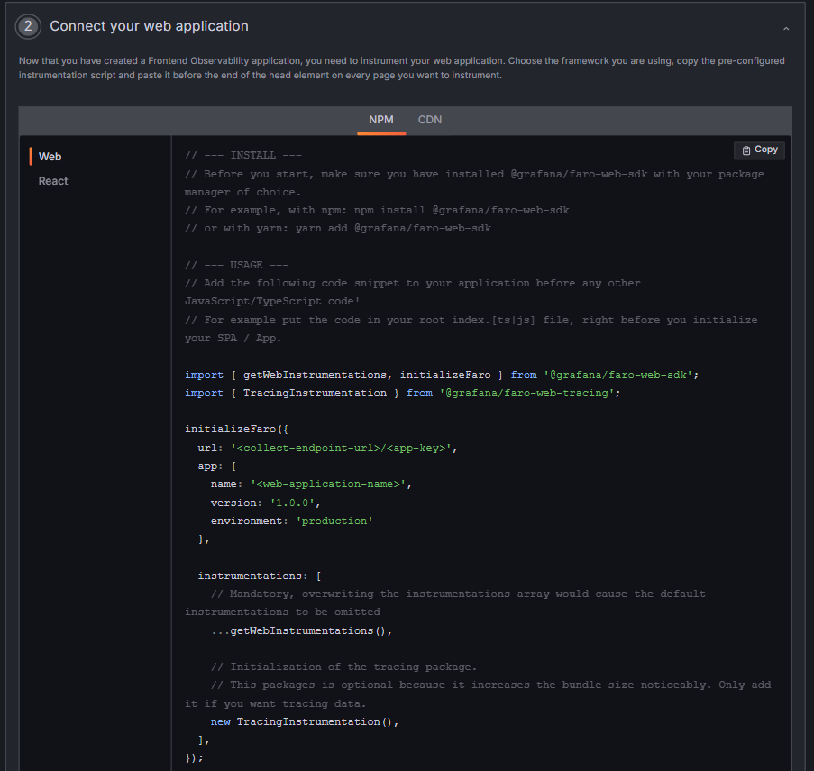

# fo11y-demo

## Mastering Frontend Observability in React with Grafana Faro

Welcome to the `fo11y-demo` project! This demo application serves as the foundation for a video tutorial teaching you how to instrument a React application with Grafana Faro. The tutorial is hosted on YouTube: [Mastering Frontend Observability in React with Grafana Faro](https://youtu.be/IA_-zkpVhIU).

## Project Structure

The project is divided into two main folders:

1. **frontend**: Contains the React application.
2. **steam-service**: Contains the backend service.

## Getting Started

### Prerequisites

Make sure you have the following installed on your machine:

- Node.js
- npm (Node Package Manager)

### Running the Frontend

1. Navigate to the frontend directory:

    ```bash
    cd frontend
    ```

2. Install the dependencies:

    ```bash
    npm install
    ```

3. Start the frontend application:

    ```bash
    npm start
    ```

   The frontend application will be running at [http://localhost:3000](http://localhost:3000).

### Running the Backend

1. Navigate to the backend directory:

    ```bash
    cd steam-service
    ```

2. Install the dependencies:

    ```bash
    npm install
    ```

3. Start the backend service:

    ```bash
    npm start
    ```

   The backend service will be running at [http://localhost:1337](http://localhost:1337).

## Purpose

The purpose of this app is to provide a foundation for a video tutorial teaching you how to instrument a React application with Grafana Faro. The tutorial covers:

- Creating a Grafana Faro (Frontend Observability) app in Grafana Cloud
- Setting up Grafana Faro in a React application
- Frontend Observability Overview in Grafana Cloud

### Setting Up Grafana Faro (Frontend Observability) in Grafana Cloud

#### Step 1: Create a Grafana Cloud Account

1. **Sign Up for Grafana Cloud:**
   - Go to [Grafana Cloud](https://grafana.com/products/cloud/) and sign up for an account.
   - Follow the instructions to create your account and log in to the Grafana Cloud platform.

2. Go to `Frontend` section and create a new application:
    - Fill up the sections. 
    
    - Now that we have created a Frontend Observability application, we need to instrument our web application. Choose the framework you are using, copy the pre-configured instrumentation script and paste it before the end of the head element on every page you want to instrument.
    

### Setting Up Grafana Faro in a React Application

#### Step 1: Install Required Packages

1. **Install Grafana Faro SDK:**
   - Use npm or yarn to install the Grafana Faro SDK in your React application:
     ```bash
     npm install @grafana/faro-react @grafana/faro-web-tracing
     ```

#### Step 2: Instrumenting Various Parts of the Frontend

1. Now in the `index.js` file paste the pre-configured instrumentation script and make few changes here,

```js
import React from 'react';
import ReactDOM from 'react-dom/client';
import './index.css';
import App from './App';


// pre-configured instrumentation script
import { createRoutesFromChildren, matchRoutes, Routes, useLocation, useNavigationType } from 'react-router-dom';
import { getWebInstrumentations, initializeFaro, ReactIntegration, ReactRouterVersion } from '@grafana/faro-react';
import { TracingInstrumentation } from '@grafana/faro-web-tracing';

initializeFaro({
  url: 'https://faro-collector-prod-us-east-0.grafana.net/collect/279506015931a091184db094e40c889a',
  app: {
    name: 'CP-Fo11-Demo',
    version: '1.0.0',
    environment: 'production'
  },
  
  instrumentations: [
    // Mandatory, overwriting the instrumentations array would cause the default instrumentations to be omitted
    ...getWebInstrumentations(),

    // Initialization of the tracing package.
    // This packages is optional because it increases the bundle size noticeably. Only add it if you want tracing data.
    new TracingInstrumentation(),

    // Integrate with React Router 6
    new ReactIntegration({
      router: {
        version: ReactRouterVersion.V6,
        dependencies: {
          createRoutesFromChildren,
          matchRoutes,
          Routes,
          useLocation,
          useNavigationType
        },
      }
    })
  ],
});


const root = ReactDOM.createRoot(document.getElementById('root'));
root.render(
  <React.StrictMode>
    <App />
  </React.StrictMode>
);
```
2. In the App.js change the <Routes>...</Routes> to 

    ```js
    <FaroRoutes>
        <Route path="/" element={<Home />} />
        <Route path="/favorites" element={<Favorites />} />
        <Route path="/search" element={<Search />} />
        <Route path="/about" element={<About />} />
      </FaroRoutes>
    ```
### Frontend Observability Overview in Grafana Cloud

In the overview tab of our Frontend Observability in Grafana Cloud, after refreshing the page, we'll start seeing data sent to our Grafana Faro instance, visualized on our dashboard. Currently, we're observing page loads and detailed web vitals metrics like time to first byte, first contentful paint, largest contentful paint, cumulative layout shift, first input delay, and time to interactive. Additionally, we're tracking errors encountered by our application in real-time, displayed prominently in red. Our page performance section is segmented by route, due to our React integration with the React Router, providing insights into specific sections like favorites, search, and the root page. Below these, three panels illustrate key metrics at the 75th percentile, such as page load times, cumulative layout shift, and input response time, offering a comprehensive overview of user experience across our application.


### Conclusion

By following these steps, you will have successfully set up Grafana Faro in Grafana Cloud, integrated it into your React application, and instrumented various parts of your frontend for observability. Grafana Faro allows you to collect metrics, logs, and traces from your application, providing valuable insights into its performance and health.

If you have any specific configurations or advanced setups, refer to the 

- [Frontend Observability instrumentation setup for React](https://grafana.com/docs/grafana-cloud/monitor-applications/frontend-observability/instrument/faro-react/) 
- [Frontend Observabillitty](https://grafana.com/docs/grafana-cloud/monitor-applications/frontend-observability/)

for further details and options.

